# Azure IoT Hub demo - setup instructions

To run the demo code, do the following:

1. Clone this repo and open [IOTBus.sln](IOTBus.sln) in Visual Studio 2015

1. Sign up for a free Google Maps API account [here](https://developers.google.com/maps/documentation/javascript/get-api-key) and make note of your API key (you'll need it below) 

1. Log in to the [Azure portal](https://portal.azure.com) with your subscription info (you can also sign up for a new subscription if you don't already have one)

1. You'll be creating the following Azure resources:

    - an IoT Hub to act as a gateway for simulated device connectivity to the cloud
    - a Storage account to act as long-term storage for raw device messages
    - a DocumentDB instance to keep a most recent state snapshot of each device
    - Two Stream Analytics jobs... one to push device messages from the IoT Hub to blob storage, and one to push messages from IoT Hub to DocDB 

   **WARNING: Many Azure resources will bill against your account even when idling mostly unused. Be sure to remove any resources you create here when you're no longer using them.**

1. To create the storage account, click the '+ New' button in the upper left corner of the portal window, then click 'Storage' >> 'Storage acccount'.

    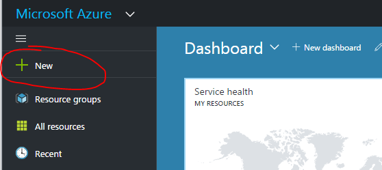

    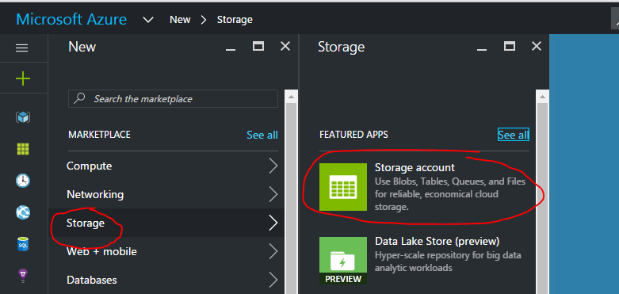

1. In the 'Create Storage Account' window, fill in unique values for account name and new resource group (remember the resource group name, you'll need it again). Your settings should look similar to this:

    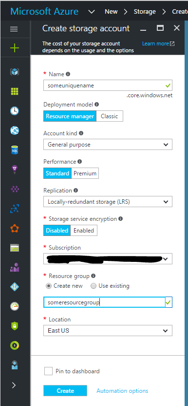

   Click 'Create' and return to the main portal screen when finished.

1. Next click the '+ New' button and select 'Internet of things' >> 'IoT Hub':

    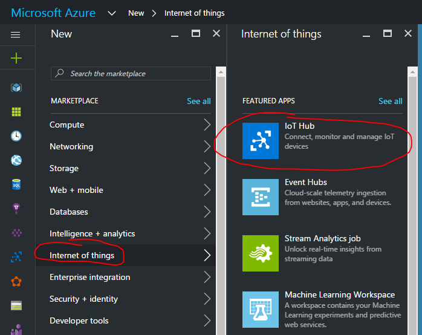

1. In the 'IoT hub' settings window, choose a unique hub name, and choose the resource group you created above for the storage account. Choose the Free pricing tier if available (you can only have one Free tier IoT Hub per subscription).

    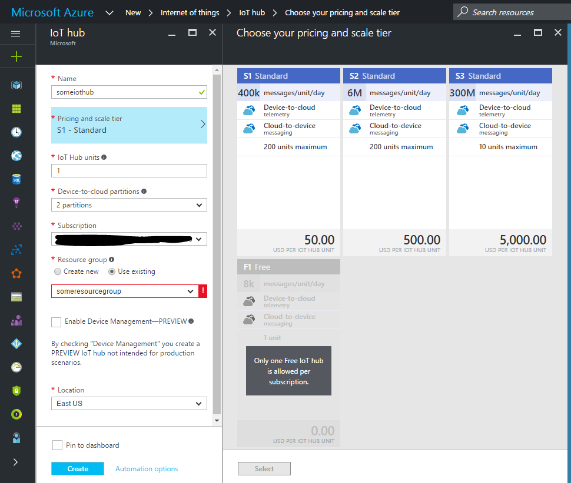

   Click 'Create' and return to the main portal screen when finished.

1. There is one more bit of configuration for your new IoT Hub to do. From the main portal screen, click 'All resources' and then select the IoT Hub you just created from the list. You should see a screen like the following:

    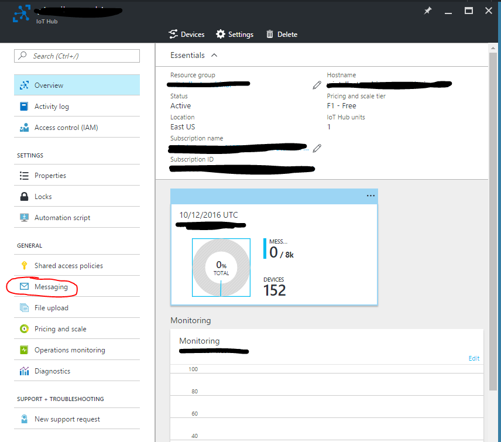

   Click the 'Messaging' menu item to open the Messaging settings. Scroll to the bottom and add three new consumer groups, like so:

    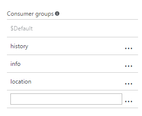

   These consumer groups are copies of all messages sent from each device, one for each intended use (raw history, most recent snapshot, and live location tracking). Click 'Save' at the top of the Messaging settings window, then return to the main portal screen.

1. Click the '+ New' button and select 'Databases' >> 'DocumentDB (NoSQL)':

    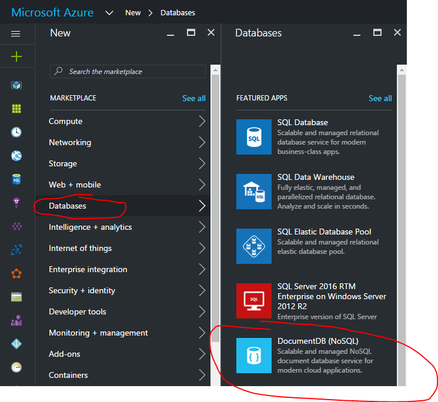

   In the DocumentDB 'New account' window, enter a unique account name, and use the existing resource group from prior steps above. Leave the other values at their defaults, then click 'Create'.

1. Once your database account is created, click on it in the 'All resources' window and see the main settings window:

    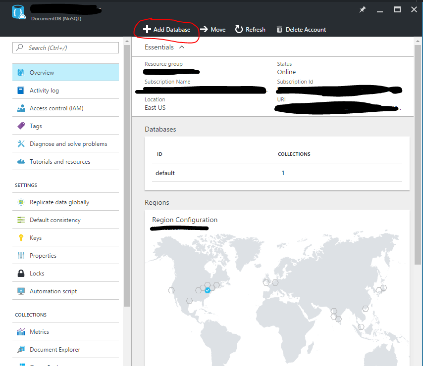

   Then click on the 'Add Database' menu item at the top. Enter 'default' as the database name and click 'OK'.

1. Once your database is created, click on its name in the Databases list in the account window. Then click the 'Add Collection' menu item near the top of the window:

    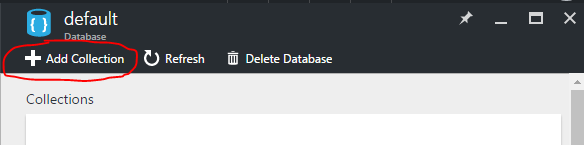

   In the 'Add Collection' window, use 'buses' as the collection ID and change 'Throughput (RU/s)' to 400 (the minimum value). Leave all other values at their defauls and click 'OK' and return to the main portal window.

1. Now you'll create the Stream Analytics job that will listen for messages on the IoT Hub and forward them to DocumentDB to keep track of the most recent state of all devices connected to your IoT Hub. Click '+ New' and then "Intelligence + analytics" >> "Stream Analytics job":

    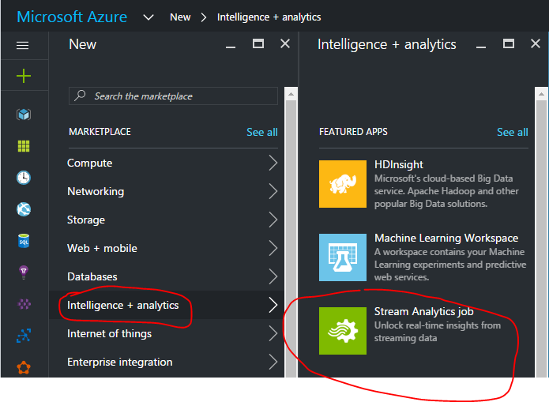

   Next, enter a new job name, and choose the resource group you've used above.

1. Stream Analytics jobs require at least one input, one output, and a query that maps from input to output. Click the SA job you just created, and then click the 'Inputs' area in job settings:

    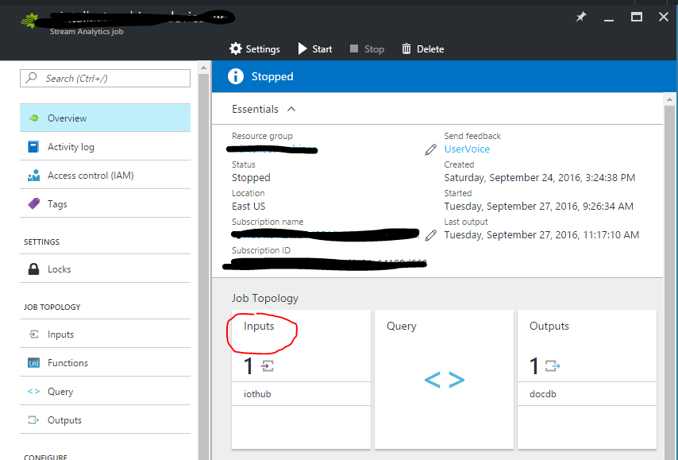

   Now click 'Add' at the top. Enter an input alias, then under 'Source' select 'IoT Hub'. Under 'Subscription' choose 'Use IoT Hub from current subscription'. Ensure that your new IoT Hub is selected, and that the 'info' Consumer Group is selected:

    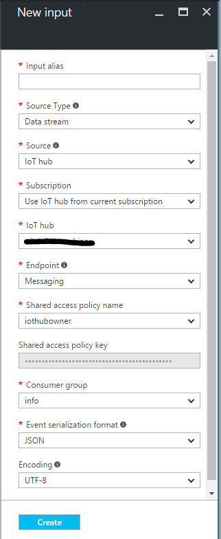

   Click 'Create' and go back to the main SA job settings window.

   Next click on 'Outputs' and then 'Add' near the top. Under 'Sink' choose 'DocumentDB' and for 'Subscription' choose 'Use document database from current subscription'. Ensure that your DocDB account and 'default' database are selected. For 'Collection name pattern' use 'buses', for 'Partition key' use 'Partition' and for 'Document id' use 'VehicleId'.

   Click 'Create' and return to the main SA settings window.

   Now click on 'Query':

    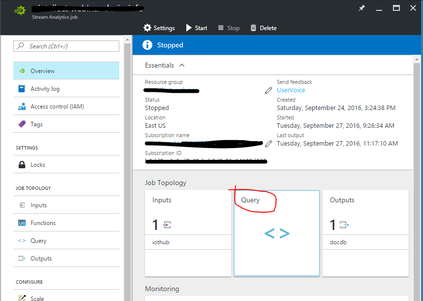

   In the query window, enter 'SELECT * INTO [docdb] FROM [iothub]' (where 'docdb' is the alias of your DocumentDB output and 'iothub' is the alias of your IoT Hub input). Click 'Save' at the top and return to the main SA settings window.

   Finally, you need to start your SA job. Click 'Start' on the main Stream Analytics job window, use the default setting of starting 'Now', and start the job. 

1. Now you'll create the Stream Analytics job that will listen for messages on the IoT Hub and forward them to blob storage for archival purposes (perhaps they'll be used for analytics in the future, etc.).

   Repeat the above steps, this time using Azure blob storage as the output instead of DocumentDB. As part of the output configuration, create a new blob container called 'history', and use '{date}' as the 'Path pattern' in blob output settings. Also, ensure the 'history' consumer group is configured in the IoT Hub input. Use the same query pattern to forward all device messages from the IoT Hub to blob storage (in a real-world application you may want to filter, etc. as part of your SA job logic).

    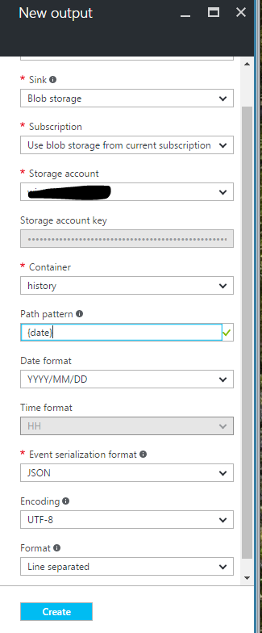

1. The final step in the setup process is to update configuration settings in the code to point to the Azure resources you've just created. If you haven't already, clone this GitHub repo and then update these config values:

    - in [Web/web.config](web/web.config) set the 'docdbUri' value using the URI for your DocDB instance:

       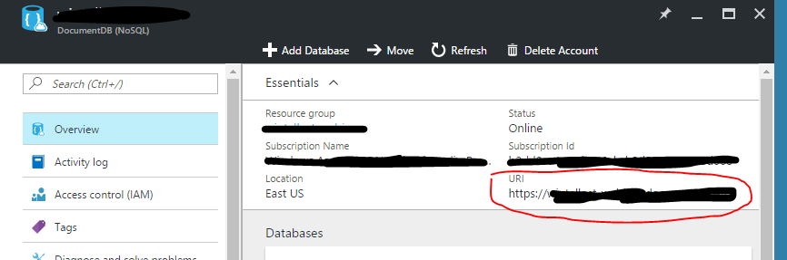

      It should look like 'https://SOMETHING.documents.azure.com:443/'.

    - in [Web/web.config](web/web.config) set the 'docdbKey' value using the value for your DocDB instance found under the 'Keys' window:

       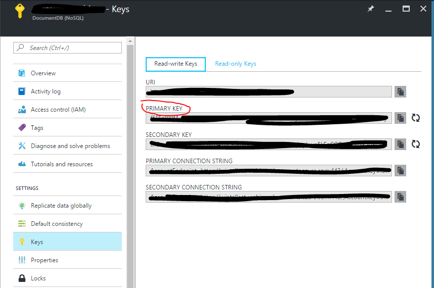

    - in [Simulator/app.config](simulator/app.config) set 'iotHubHostName' to the value on your IoT Hub main settings window:

       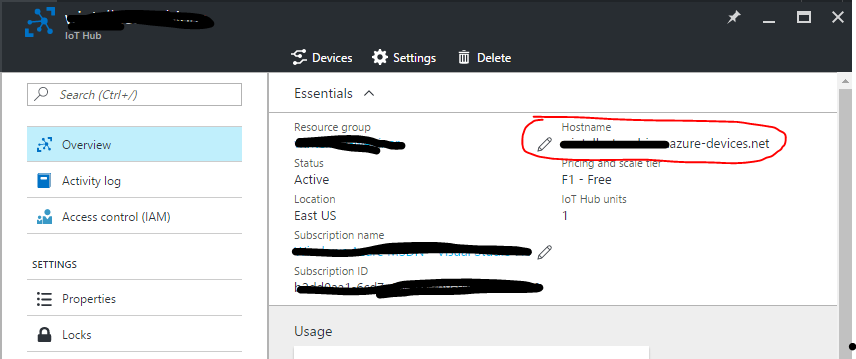

    - in [Simulator/app.config](simulator/app.config) set 'iotHubServiceConnection' to the value on your IoT Hub shared access policies window:

       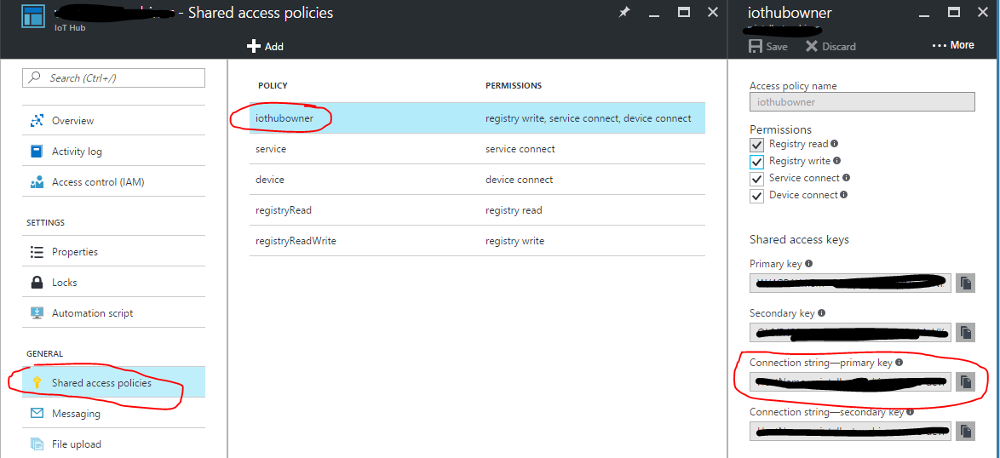

    - in [Listener/app.config](listener/app.config) set 'ehConnection' to another connection string from your IoT Hub shared access policies window:

       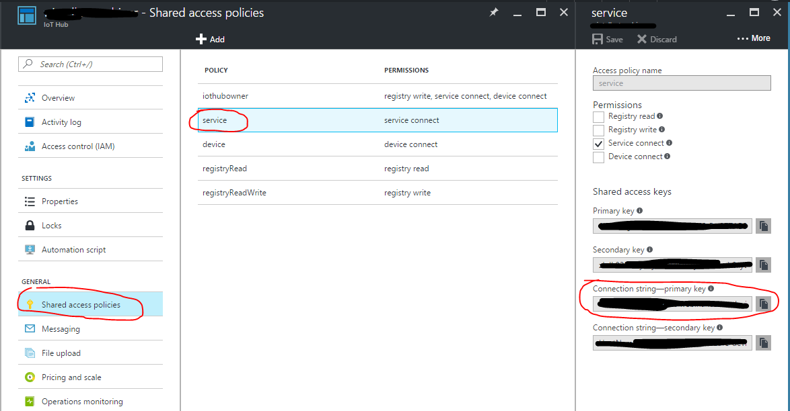
    
    - in [Listener/app.config](listener/app.config) set 'storageConnection' to a value based on the following pattern, using values in your storage account 'Access keys' window:

       'DefaultEndpointsProtocol=https;AccountName=STORAGE-ACCOUNT-NAME;AccountKey=KEY1-VALUE'

       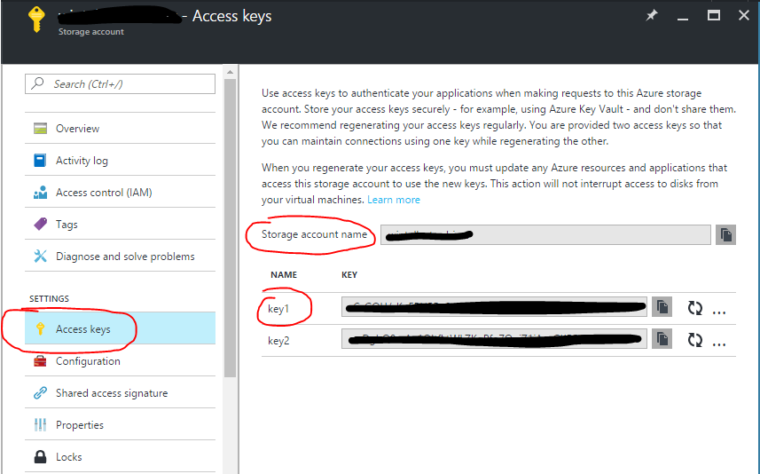

    - in [Web/main.html](web/main.html) on line 98 add your Google Maps API key

1. At this point you should be able to debug the Visual Studio solution using the standard F5 debug experience. The Simulator project will generate device messages and submit them to the IoT Hub, where they're picked up by the two Stream Analytics jobs and the custom Listener code. The main.html page in the Web project shows the buses on the Google map and updates their status as they move, using SignalR browser push messages.
 
